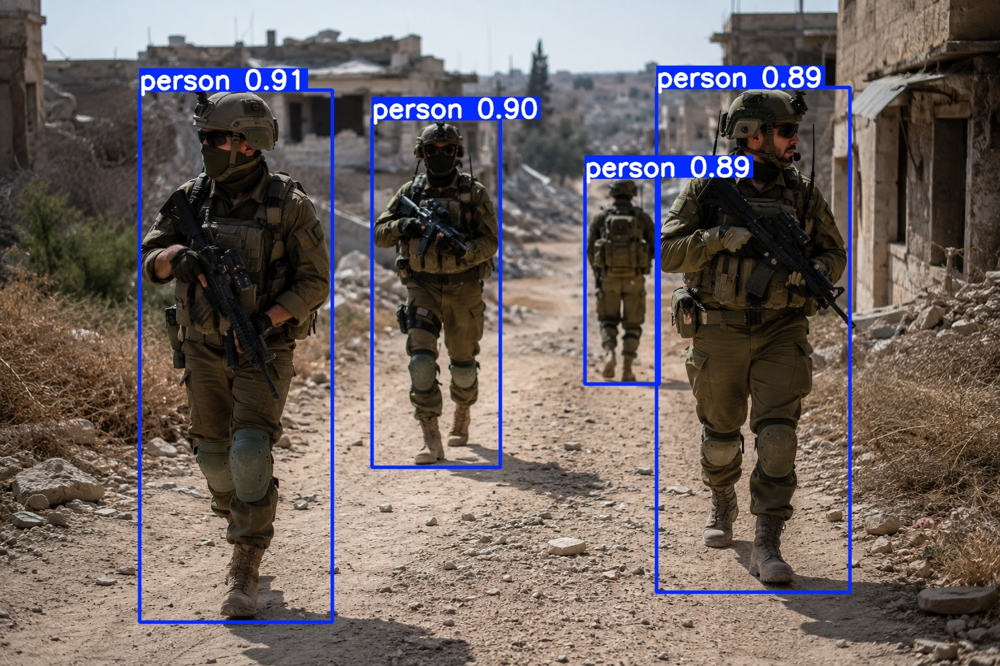

# ResQVision

**GPU-Accelerated Battlefield Casualty Prioritization using CUDA Attention, Drone Vision, and ResQBand-Inspired Telemetry**

---

## Overview

ResQVision is a research-oriented simulation platform for real-time battlefield casualty prioritization.

The project explores how modern AI attention mechanisms can be accelerated using NVIDIA CUDA and applied to battlefield medical triage scenarios.

A simulated drone observes the battlefield while soldiers continuously transmit physiological telemetry inspired by the ResQBand concept. The system processes this information using a CUDA-accelerated scaled dot-product attention engine and generates evacuation priorities in real time.

> *"ResQVision does not only rank casualties. It converts GPU-computed risk into operational recommendations."*

ResQVision includes:
* CUDA Attention Engine
* JSON export pipeline
* React tactical dashboard
* Attention visualization layer
* Rule-based operational recommendations
* YOLO computer vision integration

The dashboard consumes CUDA-generated outputs and visualizes battlefield decision-support information.

---

## Quick Start

> Run from the **project root** (`ResQVision/`) for all commands below.

### One-time setup (Windows)

```powershell
.\setup.ps1
```

This creates a Python virtual environment, installs all dependencies from `requirements.txt`, and runs `npm install` inside `frontend/`.

---

## Data Pipeline

The ResQVision dashboard reads JSON files from:

```text
frontend/public/data/
```

The frontend is safe to run even when CUDA is unavailable. If generated JSON files are missing or invalid, the dashboard falls back to existing local data or built-in mock data.

### Automatic mode

Run from the project root:

```powershell
.\run_data_pipeline.ps1
```

The script checks for both an NVIDIA GPU and `nvcc`.

* If both are available, it runs the local CUDA pipeline.
* If either is missing, it falls back to the Colab ZIP import flow.

After the pipeline finishes, start the frontend:

```powershell
cd frontend
npm run dev
```

### Local CUDA mode

Use this when running on a Windows machine with an NVIDIA GPU and CUDA Toolkit installed:

**VS Code users:** open a new terminal before running the CUDA pipeline and verify that both the Visual Studio C++ compiler and CUDA compiler are available:

```powershell
where cl
nvcc --version
```

If `where cl` does not find `cl.exe`, use an **x64 Native Tools Command Prompt for VS** or configure your VS Code terminal to start in the x64 Native Tools environment. The CUDA build needs that x64 Visual Studio compiler environment before `nvcc` can compile `resqvision.cu`.

```powershell
.\scripts\check_cuda.ps1
.\scripts\run_cuda_local.ps1
```
Generated files:

```text
outputs/benchmark_results.csv
outputs/risk_ranking.csv
outputs/attention_stats.csv

frontend/public/data/benchmark_results.json
frontend/public/data/risk_ranking.json
frontend/public/data/attention_stats.json
```

To convert the CSV files into the JSON format that the frontend expects, run:

```powershell
python scripts/csv_to_json.py
```
This script reads `outputs/benchmark_results.csv`, `outputs/risk_ranking.csv`, and `outputs/attention_stats.csv`, then generates the corresponding JSON files in `frontend/public/data/`. If the CUDA pipeline was run with GPU-only settings, the generated JSON files will accurately reflect those results; if it was run with CPU-only mode, the JSON files will reflect the CPU-based computation.

Expected result:

```text
[OK] NVIDIA GPU detected
[OK] nvcc detected
[OK] Local CUDA data pipeline complete.
```

**Troubleshooting**:
- If `nvcc` is not found, ensure CUDA Toolkit is installed and the compiler's directory is in your system's PATH.
- If the build fails with C++ compilation errors, verify that the **Visual Studio C++ Build Tools** are installed for your version of Visual Studio.
- Always run these commands from an x64 environment (e.g., x64 Native Tools Command Prompt for VS).
- If `.\scripts\run_cuda_local.ps1` fails at the “Creating project directory” step, try creating the `outputs` folder manually before running the script again.
- If `.\scripts\run_cuda_local.ps1` fails at the “Running CUDA kernel” step and claims `resqvision` does not exist (even after successful compilation), delete the `outputs\resqvision\` folder manually and retry the script.
- If the script terminates with a segmentation fault or access violation before producing CSV output, try running the script with administrator privileges.


The local script:

* Creates `outputs/` if needed.
* Compiles `resqvision.cu` with `nvcc`.
* Runs the generated executable from `outputs/`.
* Verifies the expected CSV files.
* Converts CSV files to JSON with `scripts/csv_to_json.py`.
* Writes JSON files to `frontend/public/data/`.

### Colab fallback mode

Use this when local CUDA is unavailable.

1. Open and run `ResQVision_Colab_Workflow.ipynb` in Google Colab.
2. Download `resqvision_cuda_outputs.zip`.
3. Place it in your Windows Downloads folder:

```text
%USERPROFILE%\Downloads\resqvision_cuda_outputs.zip
```

Then run:

```powershell
.\scripts\import_colab_outputs.ps1
```

If the ZIP is missing, the script prints:

```text
[ACTION REQUIRED] Run the Colab notebook and download resqvision_cuda_outputs.zip
```

Existing frontend JSON files are left untouched.

### Expected output files

CSV files generated by local CUDA:

```text
outputs/benchmark_results.csv
outputs/risk_ranking.csv
outputs/attention_stats.csv
```

JSON files consumed by the frontend:

```text
frontend/public/data/benchmark_results.json
frontend/public/data/risk_ranking.json
frontend/public/data/attention_stats.json
```

### Troubleshooting

* `[WARN] NVIDIA GPU not detected`: Install NVIDIA drivers or use the Colab fallback mode.
* `[WARN] nvcc not detected`: Install the NVIDIA CUDA Toolkit and make sure `nvcc` is on `PATH`.
* `resqvision_cuda_outputs.zip` missing: Run the Colab notebook export cell and download the ZIP to `Downloads`.
* CSV conversion failed: Make sure Python is installed, or run `.\setup.ps1` to create the local virtual environment.
* Do not commit generated `.exe` files, `venv/`, `yolov8n.pt`, `node_modules/`, or `temp_exports/`.

---

### Frontend

```bash
cd frontend
npm install      # skip if setup.ps1 was already run
npm run dev
```

Open [http://localhost:5173](http://localhost:5173) in your browser.

---

### YOLO Detection (Offline)

```bash
# Activate the virtual environment first
venv\Scripts\activate

python scripts/yolo_detect.py --image scripts/sample_input.png
```

Outputs written to `frontend/public/data/`:

| File | Description |
|---|---|
| `detections.json` | Per-person detection results |
| `detection_preview.jpg` | Annotated frame with bounding boxes |

The Computer Vision page in the dashboard picks these up automatically.

---

### YOLO Detection Schema

Both offline and live YOLO scripts write `frontend/public/data/detections.json` with the same schema:

```json
{
  "source": "offline_image",
  "timestamp": "2026-06-07T12:00:00Z",
  "frame_width": 640,
  "frame_height": 480,
  "detections": [
    {
      "id": 1,
      "class": "person",
      "confidence": 0.95,
      "bbox": [120, 80, 200, 340],
      "center": [220, 250]
    }
  ]
}
```

`source` is `offline_image` for `scripts/yolo_detect.py` and `live_camera` for `scripts/yolo_live.py`. Bounding boxes use `[x, y, width, height]` in pixel coordinates. `center` is `[center_x, center_y]` in image pixels.

### Visual Casualty Localization

The YOLO tactical flow demonstrates a relative visual localization layer:

```text
YOLO detection -> image center extraction -> tactical coordinate normalization -> fusion with casualty risk ranking
```

For each detected person, ResQVision reads the bounding box center and normalizes it into the tactical map's 0-1000 coordinate grid:

```text
x_map = center_x / frame_width * 1000
y_map = center_y / frame_height * 1000
```

The fusion output labels these positions as `GPS-Denied Visual Fix` with `localization_mode: visual_relative`, then associates them with the existing evacuation priority and risk category.

This demonstrates relative visual localization for tactical decision support. It is not a complete GPS-denied navigation system.

---

### Drone Image Marking Demo

The Computer Vision page also includes a frontend-only drone image marking mode. It lets the operator upload a drone frame and manually mark suspected casualty locations by clicking on the image.

Each clicked image coordinate is normalized into the same 0-1000 tactical map space:

```text
x_map = clicked_x / image_width * 1000
y_map = clicked_y / image_height * 1000
```

Those points appear on the Tactical Map as `Manual Drone Visual Fix` markers with `localization_mode: manual_visual_relative`.

This is a frontend-only visual localization demo. It does not write files, does not use a backend, does not use GPS, and does not run automatic YOLO inference on uploaded images. The existing CLI YOLO pipeline remains unchanged.

---

### Local YOLO Upload & Tactical Tagging

For a stronger local demo, ResQVision can run a small local YOLO upload server. This keeps inference on your machine and preserves the existing CLI YOLO workflow.

Start the backend:

```powershell
venv\Scripts\python.exe scripts\yolo_server.py
```

Start the frontend:

```powershell
cd frontend
npm run dev
```

Demo flow:

1. Open the Computer Vision page.
2. Upload a drone image.
3. Click `Run YOLO on Uploaded Image`.
4. Review the detection preview and YOLO detections.
5. Add or edit tactical markers on the drone image.
6. Assign Soldier IDs and ResQBand IDs.
7. Click `Save Tactical Tags`.
8. Open Tactical Command and confirm fused YOLO/manual markers appear with linked telemetry when the Soldier ID matches `risk_ranking.json`.

The local server writes generated artifacts to `frontend/public/data/`:

* `detections.json`
* `detection_preview.jpg`
* `manual_markers.json`
* `tactical_fusion.json`

These files are generated demo artifacts and should not be committed.

---

### Building a Fine-Tuning Dataset

The Computer Vision workflow can accumulate local YOLO training samples from operator-confirmed soldier positions.

Workflow:

1. Upload a drone image.
2. Run YOLO.
3. Correct detections manually by placing soldier markers.
4. Click `Save Tactical Tags` to store the tagged frame in the dataset builder.
5. Click `Export Training Dataset` to create `dataset.zip`.
6. Upload `dataset.zip` to `ResQVision_Colab_Workflow.ipynb`.
7. Train the VisDrone-based model in Colab.
8. Download `best.pt`.
9. Place `best.pt` at:

```text
models/drone_tactical_best.pt
```

The local dataset builder writes accumulated samples under `temp_uploads/dataset_builder/` and exports a YOLO dataset ZIP with `data.yaml`, `images/train`, `images/val`, `labels/train`, and `labels/val`.

---

### YOLO Live Detection

```bash
venv\Scripts\activate
python scripts/yolo_live.py
```

Continuously writes `detections.json` and `detection_preview.jpg` from webcam frames. The dashboard polls for updates every second — no backend required.

---

### YOLO Tactical Fusion

```text
Webcam → YOLO → detections.json → fuse_yolo_to_tactical.py → tactical_fusion.json → dashboard
```

The fusion layer maps YOLO person detections into the same 0-1000 tactical grid used by Tactical Command. When live detections are available, the dashboard prefers `tactical_fusion.json` for map markers and top evacuation targets. If detections are missing or empty, the fusion script writes a `NO_DATA` artifact and the dashboard falls back to `risk_ranking.json`.

Offline image mode uses the same schema and fusion layer:

```bash
venv\Scripts\python.exe scripts\yolo_detect.py --image scripts\sample_input.png
venv\Scripts\python.exe scripts\fuse_yolo_to_tactical.py
```

Run manually:

```bash
python scripts/fuse_yolo_to_tactical.py
```

`run_data_pipeline.ps1` also refreshes this artifact automatically and does not fail the pipeline if YOLO data is unavailable.

Generated artifacts:
* `detections.json`
* `tactical_fusion.json`

---

### CUDA

```bash
nvcc -O2 resqvision.cu -o resqvision
./resqvision
```

Then export results to JSON:

```bash
python scripts/csv_to_json.py
```

---

### JSON Integration

After running the CUDA binary or YOLO script, generated JSON files live in:

```
frontend/public/data/
├── benchmark_results.json
├── risk_ranking.json
├── attention_stats.json
└── detections.json
```

The dashboard loads these files on startup. If any file is missing or malformed, it falls back to built-in mock data automatically — so the demo always works.

### Export from Colab

Run the last cell in `ResQVision_Colab_Workflow.ipynb` to download `resqvision_cuda_outputs.zip`, then run locally (PowerShell):

```powershell
Remove-Item ".\temp_exports" -Recurse -Force -ErrorAction SilentlyContinue
Expand-Archive "$env:USERPROFILE\Downloads\resqvision_cuda_outputs.zip" `
  -DestinationPath ".\temp_exports" -Force
Copy-Item ".\temp_exports\benchmark_results.json" ".\frontend\public\data\" -Force
Copy-Item ".\temp_exports\risk_ranking.json"       ".\frontend\public\data\" -Force
Copy-Item ".\temp_exports\attention_stats.json"    ".\frontend\public\data\" -Force
```

---

## Project Motivation

Modern battlefield environments generate large volumes of information from sensors, wearable devices, drones, and communication systems.

Medical teams and commanders must rapidly identify the most critical casualties and allocate evacuation resources efficiently.

Traditional sequential processing may become a bottleneck as the number of monitored soldiers increases.

ResQVision investigates how GPU-accelerated attention mechanisms can process battlefield telemetry in parallel and provide real-time casualty prioritization for large-scale scenarios.

The project combines concepts from:

* Parallel Computing
* CUDA Programming
* Artificial Intelligence
* Medical Decision Support
* Defense Technology
* Computer Vision

to create a realistic simulation of next-generation battlefield triage systems.

---

## Key Features

### CUDA-Accelerated Attention Engine

* Scaled Dot-Product Attention
* GPU implementation in CUDA C++
* Parallel matrix operations
* Softmax computation on GPU
* CPU vs GPU performance comparison

### Synthetic ResQBand Telemetry

Each simulated soldier generates:

* Heart Rate (HR)
* Blood Oxygen Saturation (SpO₂)
* Body Temperature
* Respiration Rate
* Motion Level
* Signal Quality
* Battery Status
* Battlefield Coordinates

### Casualty Risk Assessment

The system computes:

* Medical risk score
* Attention-based contextual relevance
* Evacuation priority ranking

### Visualization

* Attention Heatmap
* Battlefield Risk Map
* Top Evacuation Targets
* Benchmark Performance Graphs
* YOLO Detection Preview

---

## Frontend Dashboard

### Mission Plan
* Pre-operation planning dashboard
* Mission readiness overview
* Priority casualty preview
* Operational map

### Tactical Command
* Live casualty ranking
* Tactical map
* Attention halo visualization
* Recommended Actions panel
* UAV routing indicators

### Analytics
* CPU vs GPU benchmark charts
* Speedup analysis
* Correctness validation
* Performance metrics

### System Architecture
* End-to-end pipeline visualization
* Simulated vs real components
* Data flow overview

### Computer Vision
* YOLO person detection results
* Confidence scores per detection
* Bounding box coordinates
* Live refresh indicator (● LIVE) when webcam script is running
* Automatic fallback to mock data when no detection file is present

---

## JSON Integration Workflow

```
CUDA Output
↓
CSV Files
↓
JSON Export (scripts/csv_to_json.py)
↓
frontend/public/data/
↓
React Dashboard
```

Artifacts include:
* `benchmark_results.json`
* `risk_ranking.json`
* `attention_stats.json`

**Fallback behavior:**
If JSON files are unavailable, the dashboard automatically falls back to mock data.

---

## Attention Visualization Layer

`attention_stats.json` contains per-soldier attention values:
* `soldier_id`
* `max_attention`
* `mean_attention`
* `entropy`

Visualization tiers on the tactical map:
* Top 3 attention targets → 🔴 red halo
* Next 3 attention targets → 🟠 orange halo
* Remaining targets → 🔵 blue halo

The visualization is derived directly from CUDA attention outputs — no manual annotation.

---

## Operational Decision Support

The dashboard features a Recommended Action Engine that derives actions from:
* Risk ranking
* Casualty category
* Physiological status

The engine is implemented as a **pure function** (`deriveRecommendedActions`) — no backend, no ML model, deterministic and testable.

Example output:
```
1 · Evacuate Soldier 388       Risk 98.2 · HR 180 bpm · SpO₂ 74%
2 · Dispatch Trauma Team Bravo  3 critical casualties in sector
3 · Route UAV-1 to Cluster     Top 3 targets in operational range
4 · Monitor Soldier 282        HR 168 bpm · trend watch
```

**Note:** This is a rule-based prototype and not a clinical decision system.

---

## System Architecture

```text
Drone Observation Layer
            │
            ▼
Soldier Detection / Tracking (YOLO)
            │
            ▼
ResQBand Telemetry Stream
            │
            ▼
Feature Matrix Generation
            │
            ▼
CUDA Attention Engine
            │
            ▼
Risk Assessment
            │
            ▼
Evacuation Priority Ranking
            │
            ▼
Recommended Actions → Tactical Dashboard
```

---

## CUDA Components

Current CUDA kernels:

1. QKᵀ Matrix Multiplication
2. Attention Scaling (1/√d)
3. Row-wise Softmax (numerically stable)
4. Attention × V Computation

The implementation demonstrates:

* Thread-to-data mapping
* Grid and block configuration
* Global memory operations
* Numerical stability in Softmax
* CPU/GPU correctness validation

Future versions will introduce:

* Shared Memory Tiling
* Optimized Matrix Multiplication
* Kernel Fusion
* Larger-scale battlefield simulations

---

## CUDA Thread Mapping and Design Decisions

### Thread Mapping Strategy

The core CUDA computation implements the Scaled Dot-Product Attention mechanism:

```text
Attention(Q, K, V) = softmax((Q × Kᵀ) / sqrt(d)) × V
```

The computation is divided into four CUDA kernels:

1. QKᵀ Matrix Multiplication
2. Attention Scaling
3. Row-wise Softmax
4. Attention × V Multiplication

For the matrix multiplication stage, each CUDA thread computes exactly one output element:

```cpp
row = blockIdx.y * blockDim.y + threadIdx.y;
col = blockIdx.x * blockDim.x + threadIdx.x;
```

Each thread calculates:

```text
score[row][col]
```

This mapping was selected because every output element is independent and can be computed in parallel.

Boundary checks are used to avoid invalid memory accesses:

```cpp
if (row < N && col < N)
```

### Grid and Block Configuration

The project uses:

```text
2D Grid
2D Thread Blocks
```

because the attention score matrix is naturally two-dimensional.

A typical configuration is:

```text
16 × 16 Threads per Block
= 256 Threads
```

This configuration was chosen because it:

- Maps naturally to matrix operations
- Provides good GPU occupancy
- Remains well below CUDA block limits
- Allows efficient scheduling across Streaming Multiprocessors
- Balances performance and implementation simplicity

### Memory Design Decisions

The baseline implementation primarily uses global memory.

This choice was made to:

- Keep the implementation simple
- Improve readability
- Simplify correctness validation
- Make debugging easier

Separate kernels were intentionally used for:

- QKᵀ
- Scaling
- Softmax
- Attention × V

This follows the project requirements and makes each stage independently testable.

### CPU vs GPU Validation

The CUDA implementation is validated against a reference CPU implementation.

Validation includes:

- Numerical correctness checks
- Error analysis
- Top-10 ranking overlap
- Benchmark comparison

The project demonstrates approximately:

```text
49× GPU Speedup
```

for the main benchmark configuration.

### Current Bottlenecks

The current implementation focuses on correctness rather than maximum performance.

Potential bottlenecks include:

1. Global Memory Access Latency
2. Separate Kernel Launch Overhead
3. Row-wise Softmax Reductions
4. Repeated Memory Loads During Matrix Multiplication
5. Host-to-Device Data Transfers

### Future Optimization Opportunities

Future CUDA optimizations include:

- Shared Memory Tiling
- Kernel Fusion
- Memory Coalescing Improvements
- Occupancy Tuning
- Optimized Parallel Reductions
- Larger Battlefield Simulations

These optimizations can further improve performance while preserving correctness.

---

## Performance Optimization Roadmap

Current implementation focuses on correctness and baseline CUDA execution.

### Phase 1 – Baseline CUDA
* Global memory implementation
* Separate kernels
* Functional correctness validation

### Phase 2 – Shared Memory Optimization
* Tiled matrix multiplication
* Reduced global memory access
* Improved cache utilization

### Phase 3 – Advanced Optimizations
* Kernel fusion
* Memory coalescing improvements
* Occupancy tuning
* Larger battlefield simulations

### Phase 4 – Real-Time Processing
* Continuous telemetry streams
* Live drone observations
* Interactive battlefield command dashboard

---

## Benchmark Goals

| Soldiers | Attention Dimension |
|---|---|
| 128 | 64 |
| 256 | 64 |
| 512 | 64 |
| 1024 | 64 |

Metrics:
* CPU execution time
* GPU execution time
* Speedup factor
* Numerical correctness

---

## Current Demonstrated Results

* **49× GPU acceleration** (512 soldiers benchmark)
* Successful CPU/GPU correctness validation
* Top-10 overlap validation
* Attention-based casualty prioritization
* Tactical map with attention halo visualization
* Rule-based Recommended Action Engine
* YOLO computer vision integration

---

## Expected Results

The project aims to demonstrate:

* Correct numerical agreement between CPU and GPU implementations.
* Significant execution-time reduction using CUDA acceleration.
* Real-time prioritization of hundreds to thousands of simulated soldiers.
* Scalability as battlefield size increases.
* Clear visualization of casualty risk and evacuation priorities.

Success criteria include:

* CPU/GPU correctness validation
* Stable attention computation
* Measurable GPU speedup
* Reproducible benchmark results

---

## Current Repository Structure

```text
ResQVision/
│
├── resqvision.cu
├── ResQVision_Colab_Workflow.ipynb
├── setup.ps1
├── requirements.txt
├── README.md
│
├── scripts/
│   ├── yolo_detect.py
│   ├── yolo_live.py
│   ├── fuse_yolo_to_tactical.py
│   └── csv_to_json.py
│
├── outputs/
│   ├── benchmark_results.csv
│   ├── risk_ranking.csv
│   ├── attention_stats.csv
│   └── attention_heatmap.csv
│
├── frontend/
│   ├── public/data/
│   │   ├── benchmark_results.json
│   │   ├── risk_ranking.json
│   │   ├── attention_stats.json
│   │   ├── detections.json
│   │   └── tactical_fusion.json
│   └── src/
│       ├── App.jsx
│       └── styles.css
│
└── docs/
```

---

## Running in Google Colab

Compile:

```bash
nvcc -O2 resqvision.cu -o resqvision
```

Run:

```bash
./resqvision
```

Generated outputs:

* `benchmark_results.csv`
* `risk_ranking.csv`
* `attention_stats.csv`
* `attention_heatmap.csv`

Export all artifacts as ZIP — run the last cell in `ResQVision_Colab_Workflow.ipynb`.

---

## Future Work

### Computer Vision
* Multi-object tracking
* Multi-camera fusion
* Temporal casualty tracking

### Autonomous Drone Support
* GPS-denied navigation
* Visual Odometry
* SLAM-based positioning
* Live UAV integration

### Battlefield Command Center
* Real-time dashboard updates
* Drone command view
* Interactive evacuation planning
* Direct CUDA-to-dashboard streaming

### ResQBand Integration
* Real telemetry ingestion
* LoRa communication layer
* Wearable sensor network simulation
* ResQBand hardware integration

---

## Academic Context

This project was developed as part of a GPU Programming / CUDA course and focuses on applying parallel computing techniques to a realistic defense and emergency-response scenario.

---

## Author

**Niv Toren**  
B.Sc. Electrical Engineering

Areas of Interest:
- Embedded Systems
- CUDA Programming
- Computer Vision
- Artificial Intelligence
- Defense Technology
- Medical Wearable Systems

---

## Example Outputs

The project generates:

* Attention Heatmaps
* Battlefield Risk Maps
* Evacuation Priority Rankings
* CPU vs GPU Benchmark Reports
* YOLO Detection Previews with bounding boxes

Example output files:

```text
benchmark_results.csv
risk_ranking.csv
attention_stats.csv
attention_heatmap.csv
```

These outputs are used to evaluate both computational performance and battlefield decision-support quality.

---

## YOLO Detection Preview



---


