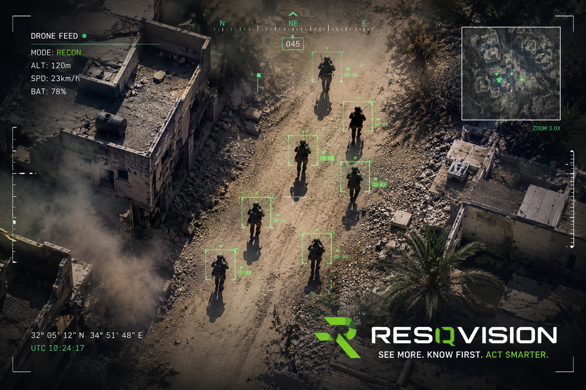

# ResQVision

**CUDA Scaled Dot-Product Attention for Battlefield Casualty Prioritization**

ResQVision is a GPU course project that implements the complete Scaled Dot-Product Attention pipeline in CUDA C++ and applies it to a simulated battlefield casualty-prioritization scenario.

The central academic deliverable is `resqvision.cu`. CUDA Attention is the core contribution. The React dashboard, YOLO scripts, ResQBand-inspired telemetry, and human-reviewed visual annotation flow are demonstration/integration layers that make the CUDA output easier to explain and visualize.

## Academic Evaluation Snapshot

| Item | Implementation |
|---|---|
| Central deliverable | `resqvision.cu` |
| Core algorithm | Scaled Dot-Product Attention |
| CPU reference | `attention_cpu_core` |
| Basic CUDA path | `qk_transpose_kernel`, `scale_kernel`, `row_softmax_kernel`, `attention_v_kernel` |
| Tiled CUDA path | `qk_transpose_tiled_kernel`, `attention_v_tiled_kernel` |
| Tile size | `TILE_WIDTH = 16` |
| Validation | Max/mean absolute error and Top-10 ranking overlap |
| Benchmark output | `benchmark_results.csv` |
| Detailed CUDA notes | `docs/CUDA_ATTENTION_DESIGN.md` |

Detailed CUDA design notes are available in [`docs/CUDA_ATTENTION_DESIGN.md`](docs/CUDA_ATTENTION_DESIGN.md).

---

## Course Requirement Coverage

The CUDA implementation covers the required attention pipeline:

```text
Attention(Q, K, V) = softmax((Q * K^T) / sqrt(d)) * V
```

Implemented stages:

1. `Q * K^T` matrix multiplication
2. Scaling by `1 / sqrt(d)`
3. Row-wise numerically stable Softmax
4. `Attention * V` matrix multiplication

The code includes:

* CUDA C++ implementation
* CPU reference implementation
* Basic CUDA implementation
* Improved CUDA tiled implementation using shared memory
* Separate kernels for the baseline path
* Boundary checks for non-exact block coverage
* Host-to-device and device-to-host memory transfers
* CPU vs CUDA basic vs CUDA tiled benchmark output
* Correctness validation using max and mean absolute error
* Top-10 casualty ranking overlap validation

---

## CUDA Implementations

`resqvision.cu` intentionally keeps two GPU paths.

### Basic CUDA Path

The basic path maps one thread to one output element and primarily reads from global memory.

Kernels:

```text
qk_transpose_kernel
scale_kernel
row_softmax_kernel
attention_v_kernel
```

This path is kept for clarity, correctness validation, and direct comparison with the optimized path.

### Tiled CUDA Path

The improved path uses shared-memory tiling for the two matrix-multiplication stages:

```text
qk_transpose_tiled_kernel
attention_v_tiled_kernel
```

The tile size is:

```cpp
constexpr int TILE_WIDTH = 16;
```

Each CUDA block computes a `16 x 16` tile. Threads cooperatively load chunks of `Q`, `K`, `Attention`, and `V` into shared memory, synchronize with `__syncthreads()`, reuse tile data, and then write output back to global memory.

This directly addresses thread mapping, shared memory, global memory latency, and tiled matrix multiplication.

---

## Benchmark Output

The benchmark measures the attention core only:

```text
QK^T -> scaling -> row-wise softmax -> Attention * V
```

`Q`, `K`, and `V` are precomputed once before timing so the CPU reference, CUDA basic path, and CUDA tiled path execute the same computational scope.

The CUDA program generates:

```text
benchmark_results.csv
risk_ranking.csv
attention_stats.csv
attention_heatmap.csv
```

`benchmark_results.csv` includes frontend-compatible fields and explicit course-analysis fields:

```text
N
CPU_time_ms
GPU_time_ms
GPU_basic_time_ms
GPU_tiled_time_ms
speedup
speedup_basic
speedup_tiled
correctness
basic_correctness
tiled_correctness
max_abs_error
mean_abs_error
basic_max_abs_error
basic_mean_abs_error
tiled_max_abs_error
tiled_mean_abs_error
top10_overlap
basic_top10_overlap
tiled_top10_overlap
```

For frontend compatibility, `GPU_time_ms`, `speedup`, `correctness`, `max_abs_error`, and `mean_abs_error` point to the tiled CUDA path.

### Measured Colab Tesla T4 Benchmark

| N soldiers | CPU core ms | GPU basic ms | GPU tiled ms | Tiled speedup | Correctness |
|---:|---:|---:|---:|---:|---|
| 128 | 2.674 | 0.088 | 0.041 | 64.819x | PASS |
| 256 | 11.259 | 0.243 | 0.086 | 131.187x | PASS |
| 512 | 46.049 | 0.836 | 0.248 | 185.682x | PASS |
| 1024 | 183.423 | 3.200 | 0.861 | 213.061x | PASS |

These values were measured on a Google Colab Tesla T4 runtime and should be interpreted as benchmark results from that environment, not as universal guaranteed performance on every GPU.

Correctness validation:

```text
Top-10 overlap: 10/10
Max absolute error: approximately 1e-6 to 2.5e-6
Correctness: PASS
```

---

## Build and Run Locally

Run from the project root.

```powershell
.\scripts\check_cuda.ps1
.\scripts\run_cuda_local.ps1
```

The local runner compiles `resqvision.cu`, runs the CUDA benchmark, verifies the generated CSV files, and converts compact CSV artifacts to frontend JSON files.

Manual compile option:

```powershell
nvcc -O2 --expt-relaxed-constexpr resqvision.cu -o resqvision.exe
.\resqvision.exe
python scripts\csv_to_json.py
```

Optional architecture override:

```powershell
$env:CUDA_ARCH="sm_89"
.\scripts\run_cuda_local.ps1
```

Use the override only when you know the target GPU architecture. Without it, the script uses a portable `nvcc` command.

---

## Google Colab

Use `ResQVision_Colab_Workflow.ipynb` when local CUDA is unavailable.

Recommended Colab flow:

1. Runtime -> Change runtime type -> GPU
2. Run the notebook cells in order
3. Compile `resqvision.cu`
4. Run the benchmark
5. Export `resqvision_cuda_outputs.zip`
6. Import the outputs locally with:

```powershell
.\scripts\import_colab_outputs.ps1
```

---

## Optional Demo Layers: Dashboard, YOLO, and Human Review

These layers support integration, visualization, and presentation. They are not the core CUDA requirement.

After generating JSON files:

```powershell
cd frontend
npm install
npm run dev
```

Open:

```text
http://localhost:5173
```

The dashboard visualizes:

* CUDA benchmark results
* Casualty risk ranking
* Tactical map
* Attention-derived prioritization
* Rule-based operational recommendations
* Optional YOLO/manual visual localization demo

The dashboard reads generated artifacts from:

```text
frontend/public/data/
```

If generated JSON files are missing, the dashboard can fall back to existing demo data or mock data.

The intended story is:

```text
Drone vision gives visual localization.
ResQBand-style telemetry gives medical state.
CUDA attention ranks casualties in parallel.
The dashboard turns the result into operational decisions.
```

Local YOLO tools may generate:

```text
frontend/public/data/detections.json
frontend/public/data/detection_preview.jpg
frontend/public/data/tactical_fusion.json
```

The final presentation Computer Vision page prioritizes:

```text
frontend/public/data/human_review_preview.jpg
frontend/public/data/human_review_detections.json
```

Raw YOLO debug output remains available with:

```text
?debug=1
```

If YOLO artifacts are missing or noisy, the dashboard still works from CUDA-generated `risk_ranking.json` and the human-reviewed demo preview.

---

## CUDA Thread Mapping Summary

### Q * K^T and Attention * V

A 2D grid and 2D block layout is used:

```cpp
row = blockIdx.y * blockDim.y + threadIdx.y;
col = blockIdx.x * blockDim.x + threadIdx.x;
```

Each valid thread computes one matrix output element. Boundary checks prevent invalid memory accesses when matrix dimensions do not divide evenly by the block size.

### Tiled Shared Memory

The tiled implementation uses:

```text
TILE_WIDTH = 16
16 x 16 threads per block
```

For `Q * K^T`, each block loads a tile of `Q` and a tile of `K` into shared memory.

For `Attention * V`, each block loads a tile of the attention matrix and a tile of `V` into shared memory.

Threads synchronize between tile loads and accumulate partial dot products before writing the final output element.

### Softmax

One CUDA block owns one row of the attention score matrix. Threads scan the row with a stride and use shared-memory reductions for:

1. Row maximum
2. Exponential sum
3. Normalization

The implementation subtracts the row maximum before exponentiation for numerical stability.

### Matrix Layout Note

The mathematical formula is written as:

```text
Attention(Q, K, V) = softmax((Q * K^T) / sqrt(d)) * V
```

In the implementation, `Q`, `K`, and `V` are stored as row-major `N x d_model` arrays. Each row represents one soldier/token embedding. Therefore, each score is computed as:

```text
score[row, col] = dot(Q[row, :], K[col, :])
```

This produces the same `N x N` attention score matrix required by `Q * K^T`.

---

## Bottlenecks and Discussion Points

Expected bottlenecks:

* Global memory traffic in matrix multiplication
* Softmax row reduction cost
* Kernel launch overhead from separate stages
* Host-to-device and device-to-host transfer overhead
* Limited benefit of tiling for small `d_model = 64`
* Shared-memory synchronization overhead

Important presentation note:

Tiled CUDA is included to demonstrate the optimization method requested in the course. Depending on GPU, driver, problem size, and workload, the tiled version may or may not scale identically across machines. The correct academic discussion is not only "which number is bigger", but why memory reuse, tile size, occupancy, synchronization, and transfer costs affect the measured result.

Future CUDA optimization directions:

* Kernel fusion
* Flash-Attention-style memory-efficient attention
* Warp-level Softmax reductions
* WMMA / Tensor Core matrix multiplication
* Streaming telemetry batches

---

## Limitations

This project is a GPU course prototype and simulation. It is not a medical device, not a clinical triage system, and not a real battlefield deployment.

The casualty ranking logic is intended to demonstrate CUDA-accelerated attention and visualization of prioritization outputs. Real-world medical or operational use would require validated sensors, clinical supervision, robust communication, safety testing, and regulatory review.

---

## Repository Structure

```text
ResQVision/
  resqvision.cu
  ResQVision_Colab_Workflow.ipynb
  run_data_pipeline.ps1
  setup.ps1
  README.md
  DEMO_STEPS.md
  scripts/
    run_cuda_local.ps1
    csv_to_json.py
    check_cuda.ps1
    import_colab_outputs.ps1
    yolo_detect.py
    yolo_live.py
    fuse_yolo_to_tactical.py
  docs/
    CUDA_ATTENTION_DESIGN.md
  frontend/
    public/data/
    src/
```

Do not submit `node_modules/`, `venv/`, generated executables, ZIP files, generated datasets, model weights, or temporary upload folders.

---

## Human-Reviewed Detection Preview



---

## Author

Niv Toren
B.Sc. Electrical Engineering
